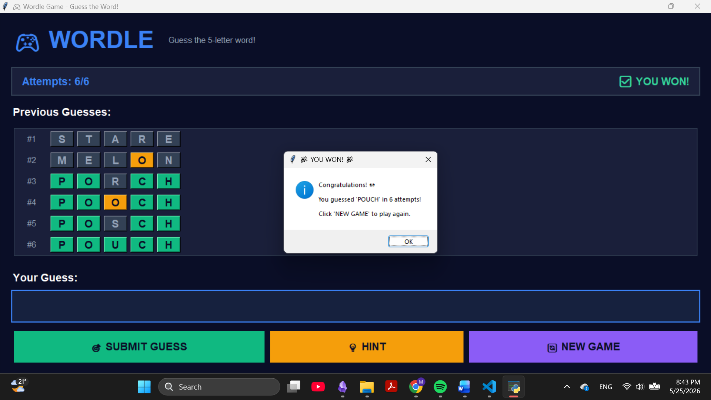

# Wordle Game 🎮

A feature-rich implementation of the popular Wordle word-guessing game, with both **console** and **beautiful GUI** versions.

## Features ✨

✅ **Two Game Modes**
   - 🖥️ Console version for terminal gameplay
   - 🎨 Beautiful GUI version with modern design

✅ **Game Features**
   - Color-coded feedback (Green = correct position, Yellow = wrong position)
   - 6 attempts to guess the word
   - Hint system with word characteristics
   - Real-time game status tracking
   - Guess history with color feedback


## Installation 📦

### Prerequisites
- Python 3.7 or higher
- tkinter (usually comes with Python)
- colorama for console colors

## Usage 🎯

### GUI Version (Recommended)
```bash
python gui_wordle.py
```

The GUI features:
- 🎨 Modern, colorful interface
- 🎯 Easy-to-use input system
- 💡 Hint button for help
- 📊 Visual guess history
- 🎮 Play multiple games in one session

### Console Version
```bash
python main.py
```

Classic terminal-based gameplay with color-coded output.

## How to Play 🕹️

1. **Guess the Word** - Enter a 5-letter word
2. **Watch the Colors**:
   - 🟩 **Green** = Correct letter, correct position
   - 🟨 **Yellow** = Correct letter, wrong position
   - ⬜ **Gray** = Letter not in the word
3. **You Win!** if you guess the word in 6 attempts or less
4. **You Lose** if you use all 6 attempts without guessing

### Example Gameplay


## File Descriptions

### `gui.py`
Beautiful tkinter-based GUI with:
- Modern color palette (dark theme with vibrant accents)
- Real-time visual feedback
- Guess history display
- Interactive buttons (Submit, Hint, New Game)
- Responsive design

### `main.py`
Console-based game loop with:
- Input validation
- Color-coded terminal output
- Attempt counter
- Win/loss handling

### `check.py`
Core game logic:
- `right_pos()` - Check correct position letters
- `letter_found()` - Check wrong position letters
- `validate_input()` - Input validation

### `colour.py`
Terminal color utilities for console feedback.

### `encrypted_word.py`
Word management:
- Loads word list from file
- Random word selection
- Error handling

## Game Logic 🧠

The game uses three main functions:

1. **`right_pos(word, encrypted)`**
   - Checks which letters are in the correct position
   - Returns: [1, 0, 1, 0, 0] (example)

2. **`letter_found(word, encrypted)`**
   - Checks which letters are in the word but wrong position
   - **IMPORTANT**: Only counts letters NOT in correct position
   - Returns: [0, 1, 0, 0, 1] (example)

3. **`validate_input(attempt, valid_words)`**
   - Ensures input is exactly 5 letters
   - Ensures input contains only letters
   - Returns: (is_valid: bool, error_message: str, normalized_word: str)

## Gameplay Tips 💡

1. **Start with common words** - Words like "CRANE", "STARE", "SLATE"
2. **Use vowels** - Try to find vowels early
3. **Avoid repeating letters** - Unless you're sure they appear twice
4. **Think strategically** - Use each guess to learn more about the word
5. **Use the hint button** - When stuck, the hint shows word characteristics


### Colors not showing in console version
Ensure you're using a terminal that supports ANSI colors (most modern terminals do).

## Performance ⚡

- **Load time**: < 1 second
- **Guess checking**: O(5) - Constant time operation
- **Memory usage**: ~150 KB
- **Word list**: 3000+ common 5-letter words

## Dependencies 📚

- **tkinter** - For GUI (included with Python)
- **colorama** - For terminal colors
  ```bash
  pip install colorama
  ```

## Quick Start 🚀

```bash
# Clone the repository
git clone https://github.com/malak887/wordle.git
cd wordle

# Install dependencies
pip install colorama

# Play the GUI version!
python GUI.py
```

**Enjoy the game! Good luck! 🍀**
